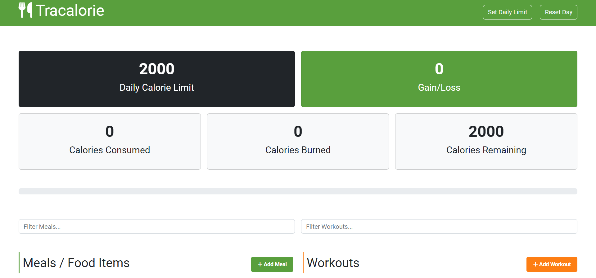

# Tracalorie App

An OOP based calorie tracker app, optimized with Webpack.

This project was created to focus on Object Oriented Programming concepts in JavaScript and was later optimized and bundled using Webpack.



## Usage

Install dependencies

```
npm install
```

Run the dev server

```
npm run dev
```

It will start on `http://localhost:3000`

To build for production

```
npm run build
```

Your production files will be in the `dist` folder.

Demo: https://tracalorie-app-demo-version.netlify.app/
